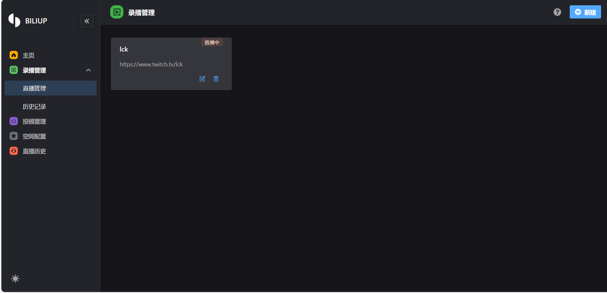

# biliup

[![Discord chat][discord-badge]][discord-url]

[discord-badge]: https://img.shields.io/discord/1015494098481852447.svg?logo=discord
[discord-url]: https://discord.gg/shZmdxDFB7

* 支持自动录制各大主流直播平台实时直播流，包括但不限于AcFun，afreecaTV，哔哩哔哩，斗鱼，抖音，虎牙，网易CC，NICO，猫耳FM，
Twitch，YY直播等，并于录制结束后自动上传到哔哩哔哩视频网站。
* 支持YouTube，twitch直播回放列表自动搬运至b站，如链接 https://www.twitch.tv/xxxx/videos?filter=archives&sort=time
* 支持录制哔哩哔哩，斗鱼，虎牙，Twitch平台的**直播弹幕**，生成B站标准格式的XML弹幕文件，可被常见的各种弹幕挂载程序使用处理
* 自动选择上传线路，保证国内外vps上传质量和速度
* 从 v0.4.32 版本开始，不依赖配置文件可直接使用webUI，若想和低于 v0.4.32 时一致使用配置文件，请添加启动参数`--no-http`
* 可分别控制下载与上传并发量
* ~~支持 cos-internal，腾讯云上海内网上传，免流 + 大幅提速~~
* 实验性功能：
    - 防止录制花屏（使用默认的stream-gears下载器就会有这个功能）
    

**更新日志**：[CHANGELOG.md](https://biliup.github.io/biliup/docs/guide/changelog)

**文档地址**：[DOCS.md](https://biliup.github.io/biliup/docs/guide/introduction/)

**社区教程**： [图文教程](https://www.bilibili.com/read/cv33195912) by [@ikun1993](https://github.com/ikun1993)

## Quick Start

1. `pip3 install biliup`
2. `biliup start`
3. 启动时访问 `http://your-ip:19159` 使用webUI，

## How to Contribute
1. 安装足够新的 nodejs `version >= 18`
2. `npm i`
3. `npm run dev`
4. `python3 -m biliup`
5. 访问`http://localhost:3000`

## Credits
* Thanks `ykdl, youtube-dl, streamlink` provides downloader.
* Thanks `THMonster/danmaku`.
> GUI：[B站投稿客户端 biliup-app](https://github.com/ForgQi/Caution)

## Stars
