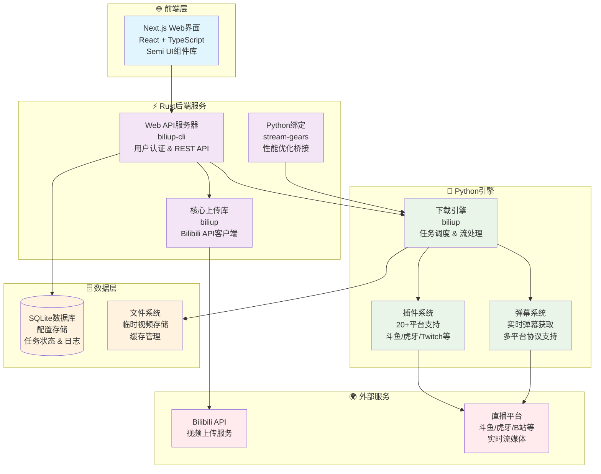

<div align="center">
  
</div>

<div align="center">

[](http://www.python.org/download)
[](https://pypi.org/project/biliup)
[](https://pypi.org/project/biliup)
[](https://github.com/biliup/biliup/blob/master/LICENSE)
[](https://t.me/+IkpIABHqy6U0ZTQ5)

[](https://github.com/biliup/biliup/issues)
[](https://github.com/biliup/biliup/stargazers)
[](https://github.com/biliup/biliup/network)

</div>


## 🛠️ 功能
* 开箱即用，多种安装方式，提供可视化WebUi界面
* 多主播录制/上传，24X7无人值守运行，高自定义元信息
* 边录边传不落盘急速上传，节省本地硬盘空间

论坛：[BBS](https://bbs.biliup.rs)

## 📜 更新日志

- **[更新日志 »](https://biliup.github.io/biliup/docs/guide/changelog)**


## 📜 使用文档
获取命令帮助 `biliup --help`
```shell
Upload video to bilibili.

Usage: biliup [OPTIONS] <COMMAND>

Commands:
  login     登录B站并保存登录信息
  renew     手动验证并刷新登录信息
  upload    上传视频
  append    是否要对某稿件追加视频
  show      打印视频详情
  dump-flv  输出flv元数据
  download  下载视频
  server    启动web服务，默认端口19159
  list      列出所有已上传的视频
  help      Print this message or the help of the given subcommand(s)

Options:
  -p, --proxy <PROXY>              配置代理
  -u, --user-cookie <USER_COOKIE>  登录信息文件 [default: cookies.json]
      --rust-log <RUST_LOG>        [default: tower_http=debug,info]
  -h, --help                       Print help
  -V, --version                    Print version
```
启动录制服务
```shell
启动web服务，默认端口19159

Usage: biliup server [OPTIONS]

Options:
  -b, --bind <BIND>  Specify bind address [default: 0.0.0.0]
  -p, --port <PORT>  Port to use [default: 19159]
      --auth         开启登录密码认证
  -h, --help         Print help
```

- [使用文档 »](https://docs.biliup.rs)

## 🚀 快速开始

### Windows
- 下载 exe: [Release](https://github.com/biliup/biliup/releases/latest)

### Linux 或 macOS
1. 安装 [uv](https://docs.astral.sh/uv/getting-started/installation/) 
2. 安装：`uv tool install biliup`
3. 启动：`biliup server --auth`
4. 访问 WebUI：`http://your-ip:19159`
* 后台运行 
  1. `nohup biliup server --auth &`
  2. [请查看参考](https://biliup.github.io/biliup/docs/guide/introduction/#linuxxia-pei-zhi-kai-ji-zi-qi)
### Termux
- 详见[Wiki](https://github.com/biliup/biliup/wiki/Termux-%E4%B8%AD%E4%BD%BF%E7%94%A8-biliup)


---

## 🧑‍💻开发
### 架构概览

Rust后端 + Python引擎 + Next.js前端的混合架构。



### frontend

1. 确保 Node.js 版本 ≥ 18
2. 安装依赖：`npm i`
3. 启动开发服务器：`npm run dev`
4. 访问：`http://localhost:3000`

### backend

1. 安装依赖 `maturin dev`
2. `npm run build` 
3. 启动 Biliup：`python3 -m biliup`

## 🤝Credits
* Thanks `ykdl, youtube-dl, streamlink` provides downloader.
* Thanks `THMonster/danmaku`.


## 💴捐赠


[爱发电 »](https://afdian.com/a/biliup)

## ⭐Stars
[](https://star-history.com/#biliup/biliup&Date)
