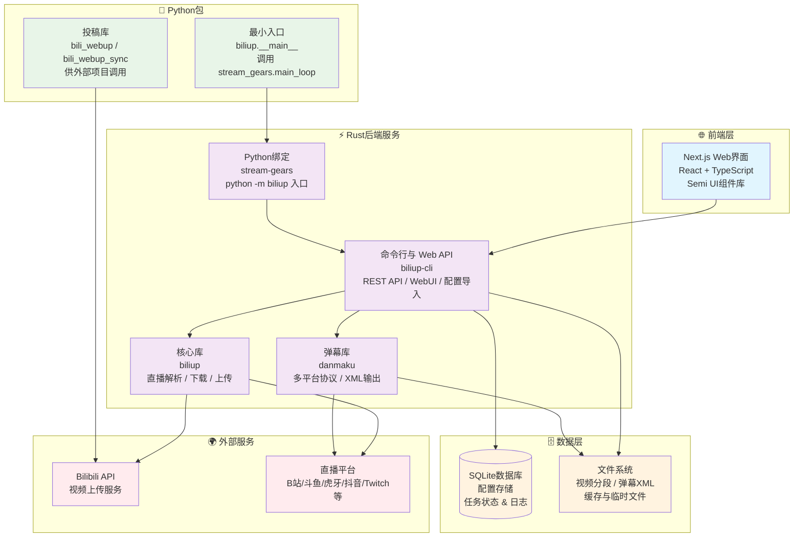

<div align="center">


[](http://www.python.org/download)
[](https://pypi.org/project/biliup)
[](https://pypi.org/project/biliup)
[](https://github.com/Aluneu/biliup/blob/master/LICENSE)
[](https://github.com/Aluneu/biliup/stargazers)
[](https://github.com/Aluneu/biliup/issues)

</div>

## ✨ 功能

- 🖥️ **可视化 WebUI**，开箱即用，无需记忆命令
- 🔄 多平台直播**录制 / 自动上传**，7×24 无人值守
- 🏷️ 高自定义元信息、多账号管理
- 🤖 提供 Agent skill，让 AI 帮你投稿：`npx skills add biliup/biliup`
- 🧩 也可作为 CLI 工具封装进自动化流程

> 论坛：[BBS](https://bbs.biliup.rs)

## 🚀 快速开始

### Windows
下载最新 Release（含桌面端）：[biliup-app](https://github.com/Aluneu/biliup/releases/latest)

### Linux / macOS
1. 安装 [uv](https://docs.astral.sh/uv/getting-started/installation/)
2. 安装：`uv tool install biliup`
3. 启动：`biliup server --auth`
4. 打开 WebUI：`http://你的IP:19159`

   后台运行：
   ```shell
   nohup biliup server --auth &
   ```
   > 开机自启等进阶配置见 [Linux 参考](https://biliup.github.io/biliup/docs/guide/introduction/#linuxxia-pei-zhi-kai-ji-zi-qi)

### Termux
详见 [Wiki](https://github.com/Aluneu/biliup/wiki/Termux-%E4%B8%AD%E4%BD%BF%E7%94%A8-biliup)

## 📖 使用文档

完整文档请访问 👉 **[doc.biliup.rs](https://doc.biliup.rs/)**

常用命令：
```shell
biliup login    # 登录 B 站并保存登录信息
biliup upload   # 上传视频
biliup server   # 启动 Web 服务（默认端口 19159）
```
更多子命令与参数，执行 `biliup --help` 查看。

## ⚠️ 免责声明

> [!IMPORTANT]
> - 本项目仅供个人学习研究，不保证稳定性，不提供技术支持
> - 使用本项目产生的一切后果由用户自行承担
> - 禁止商业用途，请遵守版权及平台规定
> - This project is for **personal learning and research purposes only**
> - No stability guarantee or technical support provided
> - Users are solely responsible for any consequences of using this project
> - Commercial use is strictly prohibited
> - Please respect copyright and platform ToS

## 📜 更新日志

- **[更新日志 »](https://biliup.github.io/biliup/docs/guide/changelog)**

## 🧑‍💻 开发

<details>

### 架构概览

Rust 后端 + 精简 Python 包 + Next.js 前端的混合架构。


```mermaid
graph TB
    subgraph "🌐 前端层"
        UI[Next.js Web界面<br/>React + TypeScript<br/>Semi UI组件库]
    end

    subgraph "⚡ Rust后端服务"
        CLI[命令行与 Web API<br/>biliup-cli<br/>REST API / WebUI / 配置导入]
        CORE[核心库<br/>biliup<br/>直播解析 / 下载 / 上传]
        DANMAKU[弹幕库<br/>danmaku<br/>多平台协议 / XML输出]
        GEARS[Python绑定<br/>stream-gears<br/>python -m biliup 入口]
    end

    subgraph "🐍 Python包"
        PYENTRY[最小入口<br/>biliup.__main__<br/>调用 stream_gears.main_loop]
        PYUPLOAD[投稿库<br/>bili_webup / bili_webup_sync<br/>供外部项目调用]
    end

    subgraph "🗄️ 数据层"
        DB[(SQLite数据库<br/>配置存储<br/>任务状态 & 日志)]
        FILES[文件系统<br/>视频分段 / 弹幕XML<br/>缓存与临时文件]
    end

    subgraph "🌍 外部服务"
        BILI[Bilibili API<br/>视频上传服务]
        STREAMS[直播平台<br/>B站/斗鱼/虎牙/抖音/Twitch等]
    end

    UI --> CLI
    CLI --> CORE
    CLI --> DANMAKU
    CLI --> DB
    CLI --> FILES
    CORE --> STREAMS
    CORE --> BILI
    DANMAKU --> STREAMS
    DANMAKU --> FILES
    GEARS --> CLI
    PYENTRY --> GEARS
    PYUPLOAD --> BILI

    style UI fill:#e1f5fe
    style CLI fill:#f3e5f5
    style CORE fill:#f3e5f5
    style DANMAKU fill:#f3e5f5
    style GEARS fill:#f3e5f5
    style PYENTRY fill:#e8f5e8
    style PYUPLOAD fill:#e8f5e8
    style DB fill:#fff3e0
    style FILES fill:#fff3e0
    style BILI fill:#ffebee
    style STREAMS fill:#ffebee
```

### 前端
1. 确保 Node.js 版本 ≥ 18
2. 安装依赖：`npm i`
3. 启动开发服务器：`npm run dev`
4. 访问：`http://localhost:3000`

### Python
1. 安装依赖 `maturin develop`
2. `npm run build`
3. 启动 Biliup：`python3 -m biliup`

### Rust CLI
1. `npm run build`
2. 构建 `cargo build --release --bin biliup`
3. 开发启动 BiliupR：`cargo run`

</details>

## 🤝 鸣谢

- `ykdl`、`youtube-dl`、`streamlink` 提供下载能力
- `THMonster/danmaku` 提供弹幕支持

## 💴 捐赠


[爱发电 »](https://afdian.com/a/biliup)

## ⭐ Star History

[](https://star-history.dera.page/#Aluneu/biliup&Date)
