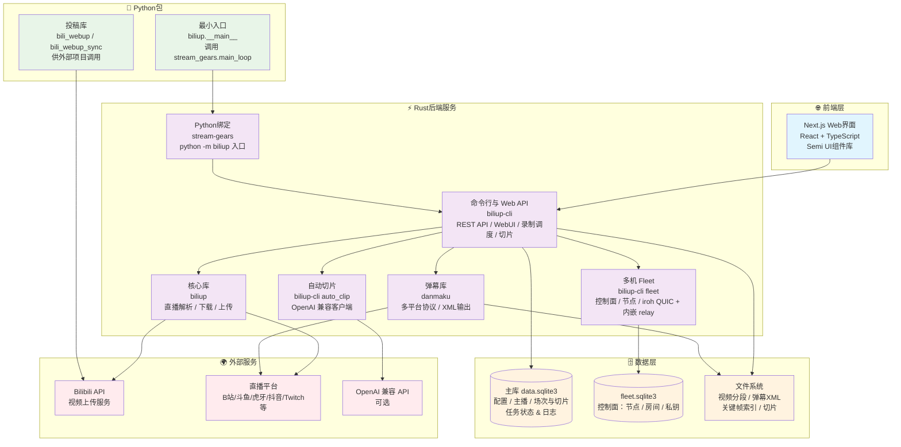

<div align="center">
  
</div>

<div align="center">

[](https://www.python.org/downloads/)
[](https://pypi.org/project/biliup)
[](https://pypi.org/project/biliup)
[](https://github.com/biliup/biliup/blob/master/LICENSE)
[](https://t.me/+IkpIABHqy6U0ZTQ5)

[](https://github.com/biliup/biliup/issues)
[](https://github.com/biliup/biliup/stargazers)
[](https://github.com/biliup/biliup/network)

</div>

## 🛠️ 功能
* 提供 skill，让你的 Agent 成为 up 主: `npx skills add biliup/biliup`
* 开箱即用，多种安装方式，提供可视化 WebUi 界面
* 多主播录制/上传，24X7 无人值守运行，高自定义元信息
* 录制同时抓取弹幕，输出 XML 弹幕文件
* 正在录制的直播间可在 WebUI 内直接预览：复用正在写盘的那一路流（不另外拉流），带封面、实时弹幕与写盘码率曲线，支持多路同屏监视
* 按场次回看录像，选段即剪，切片直接投稿
* 多机录制（Fleet）：控制面统一分派房间，节点凭票据加入
* 多用户，三种角色分级权限
* 自动切片：大模型挑出高光候选，人工确认后再切（未发版）
* 作为自动化流程中的命令行工具封装使用
* 边录边传 0 落盘

论坛：[BBS](https://bbs.biliup.rs)

## 📺 支持平台

内置 19 个直播平台解析，未匹配的地址会交给通用适配器（依赖本机的 yt-dlp / Streamlink）尝试处理。

| 平台 | 站点 | 弹幕 |
| --- | --- | :-: |
| 哔哩哔哩 | `live.bilibili.com`、`b23.tv` | ✅ |
| 抖音 | `douyin.com` | ✅ |
| 斗鱼 | `douyu.com` | ✅ |
| 虎牙 | `huya.com` | ✅ |
| 快手 | `kuaishou.com`、`chenzhongtech.com` | |
| AcFun | `acfun.cn` | |
| 网易 CC | `cc.163.com` | |
| 映客 | `inke.cn` | |
| 猫耳 FM | `missevan.com` | |
| KilaKila / 红豆 FM | `live.kilakila.cn`、`hongdoufm.com` | |
| YY | `yy.com` | |
| TTingLive | `ttinglive.com` | |
| Twitch | `twitch.tv`（直播与录像） | ✅ |
| YouTube | `youtube.com`、`youtu.be` | ✅ |
| TwitCasting | `twitcasting.tv` | ✅ |
| niconico | `nicovideo.jp` | |
| AfreecaTV | `afreecatv.com` | |
| Bigo Live | `bigo.tv` | |
| Picarto | `picarto.tv` | |
| 通用适配器 | 其他 `http(s)` 地址 | |

## ⚠️ 免责声明

> [!IMPORTANT]  
> **Disclaimer / 免责声明**
> - 本项目仅供个人学习研究，不保证稳定性，不提供技术支持
> - 使用本项目产生的一切后果由用户自行承担
> - 禁止商业用途，请遵守版权及平台规定
> - This project is for **personal learning and research purposes only**
> - No stability guarantee or technical support provided
> - Users are solely responsible for any consequences of using this project
> - Commercial use is strictly prohibited
> - Please respect copyright and platform ToS

## 🚀 快速开始

### Windows
- 下载 Release 中的桌面版安装包 [biliup_*_x64-setup.exe](https://github.com/biliup/biliup/releases/latest)，内置 FFmpeg
- 或用 Release 中的二进制 `biliupR-*-x86_64-windows.zip`，或下方 npm 方式

### Linux 或 macOS
1. 安装：下载 Release 中对应平台的 [biliupR](https://github.com/biliup/biliup/releases/latest) 二进制，解压后把 `biliup` 放进 PATH；或用下方 npm 方式
2. 启动：`biliup server --auth`
3. 访问 WebUI：`http://127.0.0.1:19159`（默认只监听本机，远程访问见下方说明）
* 后台运行 
  1. `biliup server --auth --background`（内置后台模式，启动后立即返回）
  2. 或使用 `nohup biliup server --auth &`
  3. [请查看参考](https://biliup.github.io/biliup/docs/guide/introduction/#linuxxia-pei-zhi-kai-ji-zi-qi)
### npm
- 直接运行：`npx @biliup/cli server --auth`；或全局安装 `npm i -g @biliup/cli`，之后用 `biliup server --auth`
### Termux
- 详见[Wiki](https://github.com/biliup/biliup/wiki/Termux-%E4%B8%AD%E4%BD%BF%E7%94%A8-biliup)

> [!NOTE]
> 默认下载器 `mesio`（rust-srec 引擎）和可选的 `stream-gears` 都由 Rust 实现、编进 biliup，无需外部依赖。若配置 `ffmpeg` 下载器或使用后处理，需要本机安装 `ffmpeg`；YouTube、niconico 等平台与通用适配器则依赖 `yt-dlp` 或 `streamlink`。Docker 镜像已内置 `ffmpeg`。

### 第一次使用

1. 「投稿管理」→「新增账号」扫码登录 B 站，再新建投稿模板
2. 「直播管理」→ 新增直播间，填地址、选模板
3. 等开播；录像在剪辑台「录制文件」里

录像写在工作目录下。**请备份 `data/`**：配置在 `data/data.sqlite3`，网页登录的 B 站凭据在 `data/<mid>.json`（命令行 `biliup login` 默认写 `cookies.json`）。

### 🔓 远程访问（监听 0.0.0.0）

默认的 `127.0.0.1` 只允许本机访问。需要从其他设备访问时，显式指定 `--bind 0.0.0.0` 并开启 `--auth`：

```shell
biliup server --bind 0.0.0.0 --auth
```

首次打开 `http://your-ip:19159` 会引导设置管理员密码（用户名固定为 `biliup`），之后即可正常登录使用。

> [!NOTE]
> 绑定非回环地址时必须同时开启 `--auth`，否则会拒绝启动，避免无认证的 Web API 被暴露：
>
> ```
> refusing to expose the unauthenticated Web API on 0.0.0.0:19159; use a loopback bind address or enable --auth
> ```

> [!WARNING]
> 将 Web UI 暴露到公网存在风险，建议仅在可信局域网内使用，或置于反向代理之后。
> 首次访问即可设置管理员密码，请在启动后立即完成初始化，避免被他人抢先占用。
> 若通过 **HTTPS** 反向代理访问，请加上 `--secure-session-cookie`；直接以 HTTP 远程访问时**不要**加，否则浏览器会丢弃登录态（见 [#1669](https://github.com/biliup/biliup/pull/1669)）。

#### Docker

镜像已内置 `--bind 0.0.0.0 --auth`，开箱即用，无需额外配置：

```shell
docker compose up -d
```

打开 `http://your-ip:19159` 设置管理员密码即可。录播与配置默认持久化在容器的 `/opt` 卷中（`docker-compose.yml` 默认把当前目录下的 `data/` 挂进去）。

> [!IMPORTANT]
> 若要自定义 `command`，必须带上 `--bind 0.0.0.0`。容器内若监听 `127.0.0.1`，宿主机的端口映射无法转发进容器，Web UI 将完全无法访问。

## 🎬 预览、回看与切片

一场直播记为一个「场次」，断流重连、分段都在同一条时间轴上。

- **预览**：主播卡片进预览页（`/live`），可打标记或「剪下刚才 30 秒 / 1 分钟 / 2 分钟」；多路同屏在剪辑台「实时监视」。
- **回看**：「剪辑台」（`/workbench`）→「直播场次」→ 回看页（`/replay`），直播中也能回看已落盘部分。
- **剪**：快速剪按关键帧切、不转码，入点取不晚于它的最近关键帧，保持源格式（FLV / TS / fMP4）；精确剪由 FFmpeg 重新编码为 MP4。**没装 FFmpeg 时只能快速剪、不能下载 MP4。**
- **发布**：切片按投稿模板投稿，可多选集中发布，一律按转载。队列单并发，B 站返回 601（上传太频繁）时暂停，等手动「继续」。
- **保留**：被标记、被切片引用的分段推迟到引用释放后再删。「空间配置」可设 `retention_hours`（投稿后保留小时数，默认 0）与 `min_free_space`（磁盘水位，默认关；低于阈值时先删未引用的最旧分段，不够再删被引用的，正在录的不删）。

## 🖧 多机录制 Fleet

一台控制面统一分派房间，节点各自录制、投稿。不用 Fleet 时行为不变（不监听 19160）。

1. **控制面**：`biliup server --controller`，需开放一个节点能连到的 **TCP 端口，默认 19160**（`--relay-listen` 可改）；网卡上没有公网地址时用 `--relay-url` 声明外部地址。UDP 非必需。
2. **节点**：控制面「节点」→「添加节点」生成票据，节点机执行 `biliup node join <票据>` 后重启 `biliup server`；Docker 用环境变量 `BILIUP_JOIN_TICKET`。票据带控制面的 relay 地址，节点只需出站连接，加密内建，无需证书。
3. **分派**：「节点 › 房间」手动指定或按负载自动选；改派时等原节点释放再接手（「强制迁移」除外）。未发版：节点标签、统一下发配置（Cookie、密码留在节点本地）、告警（离线 / 磁盘 / 投稿失败）、控制面「本机」当节点。
4. **备份**：控制面的 `data/fleet.sqlite3` **含控制面私钥，务必备份**，丢失需全部节点重新加入。节点凭据在 `data/node.json`（0600）；已加入的节点不能用 `--config` 启动，回到单机先 `biliup node leave`。

## 🤖 自动切片（master，未发版）

下播后按场次：FFmpeg 抽音、跳过静音 → 语音转写 → 连同弹幕密度（模型支持看图时加关键帧缩图）交大模型挑候选 → 候选进回看页，**人工接受才建切片，不自动导出或投稿**。

- **配置**：「空间配置 › 自动切片（实验）」，即全局 `[auto_clip]`，仅支持 OpenAI 兼容接口（`/chat/completions`、`/audio/transcriptions`）。chat 填 `base_url` / `api_key` / `chat_model`（key 也可用环境变量 `BILIUP_AUTO_CLIP_API_KEY`）；转写填 `asr_model`，`asr_base_url` / `asr_api_key` 留空沿用 chat 的。先「测试连接」，再开 `enabled`。
- **触发**：主播编辑里的「下播后自动生成候选」（`auto_clip_after_live`，默认关，仅超级管理员可改），或剪辑台「直播场次」手动「生成候选」（先给用量预估，费用以服务商账单为准）。
- **上限**：每场默认转写 300 分钟（`max_asr_minutes`）、chat 30 万 token（`max_chat_tokens`）；候选 72 小时未处理即过期。
- **不配置不运行**：没有 `[auto_clip]` 或 `enabled = false` 时不调用任何 API。

## 📤 边录边传（sync-downloader）

把 `downloader` 设为 `sync-downloader` 后，ffmpeg 会把直播流 remux 成 Matroska 写到 stdout，按 UPOS 分片一边录一边上传，每录满 `file_size`（默认 2.5 GB，向上对齐到 10 MiB）就作为一 P 追加到同一稿件。前提：

- 本机 `PATH` 中有 `ffmpeg`；HLS 流（B 站 `bili_protocol = "hls_fmp4"`）若装有 `streamlink` 会用它拉流再交给 ffmpeg，没有则由 ffmpeg 直拉。
- 主播必须绑定上传模板，且模板对应的 cookies 文件可用；`uploader = "Noop"` 或没有模板时不会录制，日志会给出 `边录边传需要先为主播设定上传模板`。
- 上传并发固定 3 线程，不受 `threads`、`segment_time` 控制。

```toml
downloader = "sync-downloader"
uploader = "bili_web"
file_size = 2621440000          # 每 P 大小，可按上传带宽调小
# sync_save_dir = "/data/sync"  # 可选：额外保留每 P 的本地副本

[streamers."某主播"]
url = ["https://live.bilibili.com/1234"]
title = "{streamer}%Y-%m-%d 直播录像"
tid = 171
user_cookie = "cookies.json"
```

行为说明：

- 录制期间每 P 会同时写入系统临时目录（`$TMPDIR/biliup-sync/worker-<id>/`）作为兜底；预传完整且校验一致时直接 complete，否则（直播提前结束、上传落后）按实际长度从临时文件重传。投稿确认后临时文件删除，设置了 `sync_save_dir` 的副本保留并交给 `postprocessor`。
- 停止/暂停/编辑主播只会结束当前分段，已录内容仍会上传并投稿；上传或投稿失败时保留有内容的分段文件并在日志中打印路径，可手动补传。
- B 站直链约 1 小时过期。分段结束后拉不到数据时会立刻交回监控循环重新解析直链，并在同一稿件上继续追加分 P。
- 排查问题时留意 `ERROR ... 下载流程出错` 日志：会带上具体原因（cookies 文件路径、preupload 拒绝等），而不是静默退回落盘录制。

## 🔐 用户与权限

`--auth` 下首次访问设置的 `biliup` 账号是超级管理员，其他用户在「用户管理」添加：

- **超级管理员**：全部 15 个权限点
- **操作员**：录制控制、增删改直播间、投稿模板、投稿与切片、看日志和文件；不能改空间配置、处理器钩子、B 站账号、用户与节点
- **只读观察者**：只看直播间、预览、配置（脱敏）、日志和文件

忘记密码：在服务工作目录执行 `biliup user reset-password <用户名>`（`biliup user list` 列出用户），直接改 `data/data.sqlite3`。

## 📜 命令行

B 站命令行投稿工具，支持**短信登录**、**账号密码登录**、**扫码登录**、**浏览器登录**以及**网页Cookie登录**，并将登录后返回的 cookie 和 token 保存在 `cookies.json` 中，可用于其他项目。

- 下载 Release: [biliupR](https://github.com/biliup/biliup/releases/latest)
- 获取命令帮助 `biliup --help`
- 登录信息文件可用 `-u/--user-cookie` 指定，便于多账号切换

```shell
Upload video to bilibili.

Usage: biliup [OPTIONS] <COMMAND>

Commands:
  login     登录B站并保存登录信息
  renew     手动验证并刷新登录信息
  upload    上传视频
  append    是否要对某稿件追加视频
  show      打印视频详情
  comments  查看视频评论
  reply     回复视频评论，默认只打印将要回复的内容
  dump-flv  输出flv元数据
  download  下载视频
  server    启动web服务，默认端口19159
  season    管理自己的合集：列合集、查小节、加入 / 移出稿件、排序
  user      管理 Web 界面的登录用户（在 biliup 服务的工作目录下执行，直接读写 data/data.sqlite3）
  node      把这台机器加入 Fleet 控制面或退出（在 biliup 服务的工作目录下执行，读写 data/node.json）
  list      列出所有已上传的视频
  help      Print this message or the help of the given subcommand(s)

Options:
  -p, --proxy <PROXY>              配置代理
  -u, --user-cookie <USER_COOKIE>  登录信息文件 [default: cookies.json]
      --rust-log <RUST_LOG>        日志过滤规则，如 debug；不指定时读取环境变量 RUST_LOG，都没有则为 tower_http=debug,info
  -h, --help                       Print help
  -V, --version                    Print version
```
启动录制服务
```shell
启动web服务，默认端口19159

Usage: biliup server [OPTIONS]

Options:
  -b, --bind <BIND>              Specify bind address [default: 127.0.0.1]
  -p, --port <PORT>              Port to use [default: 19159]
      --auth                     开启登录密码认证
      --secure-session-cookie    为会话 Cookie 附加 Secure 属性。仅当通过 HTTPS 反向代理访问 Web UI 时开启； 直接通过 HTTP 远程访问时开启会导致浏览器丢弃登录态
  -c, --config <FILE>            使用 biliup 1.0.7 风格配置文件启动录制
      --controller               以 Fleet 控制面运行：接受其他 biliup 节点加入并显示它们的状态（数据在 data/fleet.sqlite3）
      --relay-listen <ADDR|off>  控制面内嵌 relay 的 TCP 监听地址（默认 0.0.0.0:19160），节点必须能连到它； off 表示不起内嵌 relay，此时必须用 --relay-url 指定外部 relay。只在 --controller 时生效
      --relay-url <URL>          写进加入票据的 relay 地址，可重复；不给时自动列出本机网卡地址。 用于域名、端口转发、反向代理或外部 relay。只在 --controller 时生效
  -h, --help                     Print help
```

> [!IMPORTANT]
> 自 [#1660](https://github.com/biliup/biliup/pull/1660) 起，`--bind` 的默认值由 `0.0.0.0` 改为 `127.0.0.1`，即**默认只监听本机**，局域网/公网无法直接访问。
> 如需从其他设备访问，请加上 `--bind 0.0.0.0 --auth`，详见上方「🔓 远程访问」一节。Docker 镜像已内置该参数，不受影响。

Fleet 节点管理
```shell
把这台机器加入 Fleet 控制面或退出（在 biliup 服务的工作目录下执行，读写 data/node.json）

Usage: biliup node <COMMAND>

Commands:
  join    用控制面「添加节点」给出的票据加入；成功后重启 biliup server 生效
  leave   通知控制面移除本节点，并删除本地凭据 data/node.json
  status  查看本机的节点凭据（不连控制面）
  help    Print this message or the help of the given subcommand(s)

Options:
  -h, --help  Print help
```

单独下载一场直播/视频，无需启动服务：

```shell
biliup download <URL> -o "./video/%Y-%m-%dT%H_%M_%S{title}" --split-time 1h
```

管理自己的合集（需要先 `biliup login`，所有子命令都支持 `--json`）：

```shell
biliup season list                                # 列出合集和小节 ID
biliup season sections <合集ID>                   # 查看各小节里的稿件及其 episode ID
biliup season add <小节ID> --vid BV1xx411c7mD     # 加入稿件，cid 和标题自动获取；--vid 可重复
biliup season remove <episode ID>                 # 移出稿件
biliup season sort <小节ID> <episode ID>...       # 列出的稿件按顺序排到最前，其余保持原顺序；或用 --reverse 整体倒序
```

`--split-size` 与 `--split-time` 可按体积或时长自动分段，`-o` 支持 `{title}` 占位符与 strftime 时间格式。

## 📚 文档与更新日志

- [使用文档 »](https://biliup.github.io/biliup/docs/guide/introduction/)
- [命令行文档 »](https://biliup.github.io/biliup-rs)
- [更新日志 »](https://biliup.github.io/biliup/docs/guide/changelog)

---

## 🧑‍💻开发

<details>

### 架构概览

Rust后端 + 精简 Python 包 + Next.js前端的混合架构。


```mermaid
graph TB
    subgraph "🌐 前端层"
        UI[Next.js Web界面<br/>React + TypeScript<br/>Semi UI组件库]
    end

    subgraph "⚡ Rust后端服务"
        CLI[命令行与 Web API<br/>biliup-cli<br/>REST API / WebUI / 录制调度 / 切片]
        FLEET[多机 Fleet<br/>biliup-cli fleet<br/>控制面 / 节点 / iroh QUIC + 内嵌 relay]
        AUTOCLIP[自动切片<br/>biliup-cli auto_clip<br/>OpenAI 兼容客户端]
        CORE[核心库<br/>biliup<br/>直播解析 / 下载 / 上传]
        DANMAKU[弹幕库<br/>danmaku<br/>多平台协议 / XML输出]
        GEARS[Python绑定<br/>stream-gears<br/>python -m biliup 入口]
    end

    subgraph "🐍 Python包"
        PYENTRY[最小入口<br/>biliup.__main__<br/>调用 stream_gears.main_loop]
        PYUPLOAD[投稿库<br/>bili_webup / bili_webup_sync<br/>供外部项目调用]
    end

    subgraph "🗄️ 数据层"
        DB[(主库 data.sqlite3<br/>配置 / 主播 / 场次与切片<br/>任务状态 & 日志)]
        FLEETDB[(fleet.sqlite3<br/>控制面：节点 / 房间 / 私钥)]
        FILES[文件系统<br/>视频分段 / 弹幕XML<br/>关键帧索引 / 切片]
    end

    subgraph "🌍 外部服务"
        BILI[Bilibili API<br/>视频上传服务]
        STREAMS[直播平台<br/>B站/斗鱼/虎牙/抖音/Twitch等]
        LLM[OpenAI 兼容 API<br/>可选]
    end

    UI --> CLI
    CLI --> CORE & DANMAKU & FLEET & AUTOCLIP
    CLI --> DB & FILES
    FLEET --> FLEETDB
    AUTOCLIP --> LLM
    CORE --> STREAMS & BILI
    DANMAKU --> STREAMS & FILES
    GEARS --> CLI
    PYENTRY --> GEARS
    PYUPLOAD --> BILI

    classDef ui fill:#e1f5fe
    classDef rust fill:#f3e5f5
    classDef py fill:#e8f5e8
    classDef data fill:#fff3e0
    classDef ext fill:#ffebee
    class UI ui
    class CLI,FLEET,AUTOCLIP,CORE,DANMAKU,GEARS rust
    class PYENTRY,PYUPLOAD py
    class DB,FLEETDB,FILES data
    class BILI,STREAMS,LLM ext
```

### 目录结构

| 路径 | 说明 |
| --- | --- |
| `crates/biliup` | 核心库：直播解析、下载器、B 站投稿与凭据管理 |
| `crates/biliup-cli` | 命令行与 Web 服务：REST API、WebUI 托管、录制调度 |
| `crates/biliup-cli/src/server/{api,fleet,auto_clip}` | 分别是 Web API 路由、Fleet 控制面与节点、自动切片 |
| `crates/biliup-cli/migrations` | 主库 `data.sqlite3` 迁移（1–14） |
| `crates/biliup-cli/fleet_migrations` | Fleet 库 `fleet.sqlite3` 迁移（1–4） |
| `crates/danmaku` | 弹幕客户端：多平台协议解析与 XML 输出 |
| `crates/stream-gears` | PyO3 绑定，暴露给 `python -m biliup` |
| `app`、`public` | Next.js WebUI 源码；`npm run build` 产物输出到 `out/` 并由后端内嵌 |
| `crates/stream-gears/biliup` | 精简 Python 包：最小入口与可供外部调用的投稿库 |
| `tauri-app` | Windows 桌面端（Tauri，进程内运行 biliup 服务） |

</details>

### frontend

1. 确保 Node.js 版本 ≥ 20.9（Next.js 16 要求）；前端为 Next.js 16 / React 19 / TypeScript 6 / Semi UI
2. 安装依赖：`npm i`
3. 启动开发服务器：`npm run dev`
4. 访问：`http://localhost:3000`

### Python

1. 安装依赖 `maturin develop -m crates/stream-gears/Cargo.toml`
2. `npm run build` 
3. 启动 Biliup：`python3 -m biliup`

### Rust-cli

1. 准备 Rust ≥ 1.95（依赖 `mesio-engine` 的要求，CI 使用 stable），然后 `npm run build`
2. 构建 `cargo build --release --bin biliup`
3. 开发启动 BiliupR：`cargo run`

> [!NOTE]
> `biliup-cli` 通过 `rust-embed` 内嵌前端产物目录 `out/`，因此在 `cargo build` / `cargo test` 之前必须先执行 `npm run build`，否则编译会因 `out/` 不存在而失败。

### 测试

```shell
cargo test -p biliup -p biliup-cli -p danmaku
```

- 自动切片抽音频、取帧等用例会真的调用 `ffmpeg`，本机没装时这些用例会跳过；CI 的 Rust tests 已安装 ffmpeg。
- clippy 只对改动的 crate 跑：`cargo clippy -p <crate> --all-targets -- --no-deps`。用 `--workspace` 可能长时间不结束。
- 桌面端 `tauri-app/src-tauri` 是独立的 Cargo workspace，有自己的 `Cargo.lock`。改了 `biliup-cli` 的依赖（或根 `Cargo.lock` 变了）必须同步它，并用 `cargo metadata --locked --manifest-path tauri-app/src-tauri/Cargo.toml` 验证，CI 有同样的检查。

### 数据库迁移

主库 `data/data.sqlite3` 与 Fleet 库 `data/fleet.sqlite3` 各有一套迁移、独立编号，启动时自动执行（Fleet 库只在 `--controller` 时打开）。迁移不能回滚，升级前请备份 `data/`。

## 🤝Credits
* Thanks `ykdl, youtube-dl, streamlink` provides downloader.
* Thanks `THMonster/danmaku`.


## 💴捐赠


[爱发电 »](https://afdian.com/a/biliup)

## ⭐Stars
[](https://star-history.dera.page/#biliup/biliup&Date)
